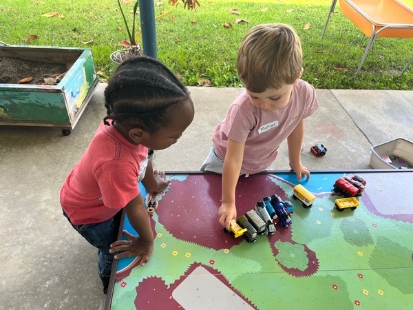
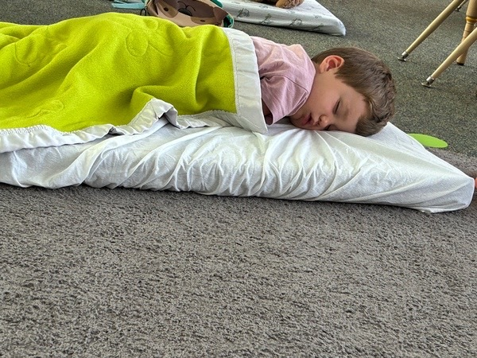
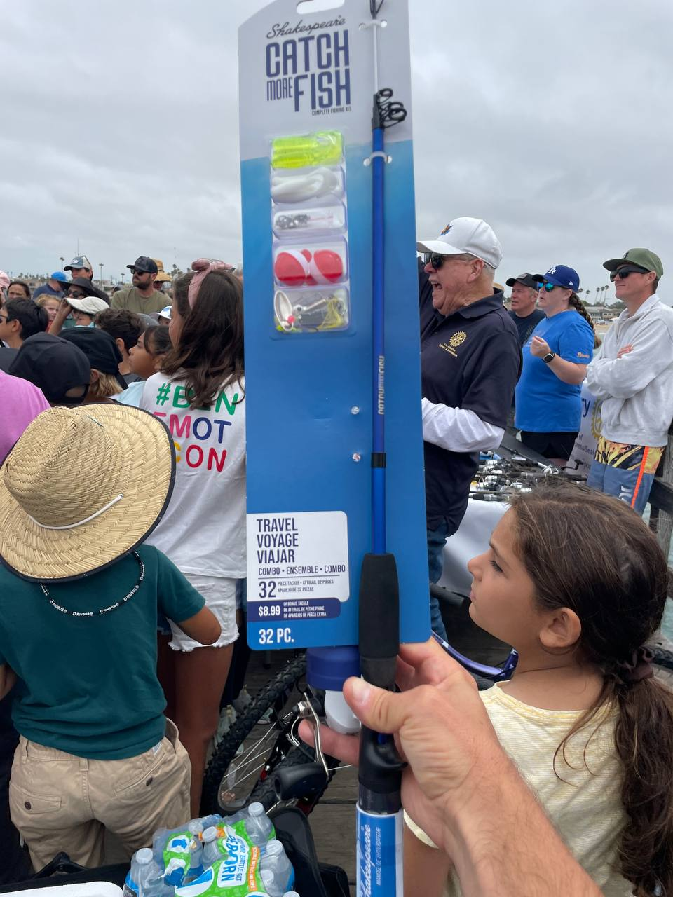

# #3 Hilary and the first week of school

Wind, rain and excitement. End with a hot chocolate.

All moms and dads know that the first few weeks of school aren't easy.

When I dropped Matias off at school for the first time I cried around the corner, and confessed to the school principal that it doesn't get any easier with the number of children. It's no different in California.

At the end of the day, we were the first to arrive and hug both Mercedes and Matias. We took a deep breath when we saw their smiles.

Matias was the best, as you can see from the photos. Miss Megan said he was shy in conversation, independent in all sorts of activities, and was one of the first to finish his lunch and screw deeply at nap time.

Mercedes was nervous, but praised all her classmates and the teacher who had made a continuous effort to communicate with her, and said she wanted to come back tomorrow. Miss Walace approached, praised the effort, and agreed that it's a tough experience to join a large group without mastering the language. Nothing new. I swallowed, and she continued... "I found Mercedes silently crying at the first text I gave her to read." 

I looked at Mercedes, who already had her teeth bared and her cheeks tense.

The teacher added, "Everything's normal! Mercedes was distressed, just like anyone else in their right mind, when faced with a communication challenge as big as this!..."

I liked the transparency, I tried \(unsuccessfully\) not to visualize Cuca silently struggling to understand the teacher, in a class where no one can speak Spanish or Portuguese... and I felt like crying myself.

Nothing different from what we expected, but I confess, this adventure also seemed like an excellent idea with the safety distance of months, and whether or not it could happen. As the plans came to fruition, it began to seem like nothing more than madness.

That day was exactly the same... It's one thing to say, of course it's going to be tough at first! It's another thing to see the hardness reflected in Cuca's cheeks with sawed-off teeth.

Miss Walace said, "We can only ask you to try your best, one class at a time." Cuca replied "I can do that!", I went into apnea and we ran home.

I'm not going to curse the Spanish timetables at school again, here they leave at 2.20 or 1.20 on Wednesdays, and Maria only leaves 1 hour later.

From day one, we agreed that Mimi would return home by bus, and so she did. As we can't communicate with her during the day, otherwise there's a mobile violation \(it's expressly forbidden to use a mobile phone at school, from the moment you enter until you leave the gates\), and the corresponding punishment \(serious!\), we were literally praying that she'd find her yellow bus and come home as straight as a post. Clutching our cell phones waiting for news, we finally got a plim!

"Papá, podes geolocalizar-me? Acho que entrei num autocarro errado e não faço ideia onde estou..." 

Vertigo was what took over my head. The non-stop phone with the grandparents asking for their granddaughter Mimi before they went to bed in Lisbon, and we had to share the adrenaline of having their grown-up daughter lost in LA on the first day of school. 

Spoiler alert, everything went well, she was on the right bus that turns around a thousand times, and she arrived proud of her achievement of having returned home on her own, safe and sound.

<video controls src="../../media/67288579-1692646245-img_8676.mov"></video>
With regard to Maria, during my visits to the school to set up the locker and collect equipment, I observed families. As my naughty daughter forbade me to interact with her peers, let alone share her fears, I changed my strategy and started chatting to people who seemed like mothers to me.

Anyone who knows me knows that I'm not exactly the queen of the living room, and striking up conversations doesn't come naturally to me, but Maria didn't give me a choice, so I set off in the direction of various mothers, with Maria always grumbling and questioning my every action. I shared with them my nervousness about integrating Mimi into this school, without knowing anyone, the places or having a group with whom she could sit down to lunch.

I think I must have managed to convey the idea of maternal nerves well with one of them. She grabbed my phone and quickly typed in her number, assuring me that Mimi would have a safe haven in her daughter Amina at that competitive school.

I took a deep breath. 

On the way home, Maria, happy and worried about all the challenges, told us that having 1 hour of English lessons every day for non-native speakers was going to be a great help. And that Amina had gathered a group of girls who had been waiting for her, and they all sat down for lunch.

And if happiness exists, it's in the visualization of this kind of thing.

In the meantime, this girl's mother, Amina, sent us a message to say how was the first day and to invite us to ice cream the next day after dinner. We accepted straight away, and suddenly realized from the time that after dinner it would be 6pm! and committed ourselves to joining in the dynamic. 

The next few days like nursery school.

Children already know what they're getting into. The harshness is real.

Long kisses and hugs and promises to do your best.

Matias apparently has no problems, he says absent-mindedly, "this is mine!" and often "ohhh so nice!... " is a pagoda.

Ice cream at 6 after dinner in the center of Seal Beach, which is really nice.

I had a freshly made ice cream with fresh strawberries and blueberries called Cheesecake Paradise. I have no better definition for it.

It was a really good evening, and we got to know the land where we landed a little better.

I myself collaborated on my first data collection, and I was introduced at the opening ceremony of the University's academic year to a lot of nice people, but I'll leave that for another post.

To round off the week, Cuca received some blue earrings like her eyes from a new friend, and the sisters demanded to take "at least soup!" to school in one term. I complied.

There are many strong points here. The school menu isn't really one of them.

Hurricane Hilary warning growing towards us. 

And an invitation to a youth fishing derby at the Seal Beach Pier. We went fishing, didn't catch anything, but it was a fun experience for everyone, except for Cuca who lost it when a "Shark" was caught, according to Matias.

<video controls src="../../media/67288595-1692647027-img_8801.mov"></video>
She felt sorry for the shark and even repeated to me today that she doesn't think it's right to clap if an animal is suffering. Take heart.

Mimi entered a raffle contest, helped organize it, and won a fishing rod!

Today marks the start of the second week, which I promised would be less difficult than the first, since you've already gotten to know the house. I hope I don't break my promise.

Hilary passed over, stirred up the waters and made it rain a lot, with wind in the mix, but nothing to frighten those who live by the Atlantic. And as it brought rain, it also brought hot chocolate. 

It could perfectly well be an analogy of what's happening to us, SFF.

It stirs everything up, and it stirs it up again, but in the end it's just a very pleasant tropical rain that gives us another perspective on everything. With hot chocolate.

I hope so.
