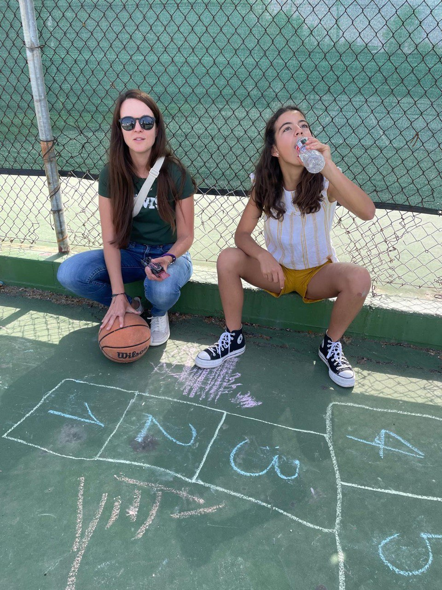

# #25 Win Win

I'm sorry to those of you who follow us closely for the lack of news. The truth is that I haven't felt like writing.

In the whirlwind of goals to meet, children's challenges, reflections on the future, weather storms, and disturbing news, when I started this post, the title was "loose-loose". As a born optimist, albeit a "control freak", I refused to maintain such a negative tone. 

And then it took me a while to pick it up again.

There are days when the silence after a video call weighs more heavily than usual. The screen goes dark, and I stare at my reflection, torn between guilt and fulfillment. The decision to live on the other side of the world brings with it impossible mathematics: for every moment gained here, there is a moment lost there. Birthdays marked only on the calendar, hugs saved for "when I get back", laughter on calls that always end too soon because of the time zone.

Between Portugal and Spain, the distance used to be a matter of hours by car, an easy bridge to cross when nostalgia or events were pressing. Now, with an ocean in between, each return needs to be planned months in advance, and each departure carries the weight of all future absences.

The hardest part is realizing that, apparently, we will never be truly whole. There's always a version of us that stays behind, sitting on the wall of Parede beach in the morning, smelling the Atlantic after a run, just inside our comfort zone, in a place so beautiful, and so much closer to most of us, waiting to return.

What do we miss most from this side? Our people. And in the meantime, we build a new life far away from everything that also becomes home, that also becomes ours, and that makes us happy in a way we didn't expect.

It's a kind of paradox: the more we realize ourselves here, the stronger the feeling that we're failing those who stayed. And the more we adapt to this new life, the more we wonder if we'll ever be that person we left waiting on the wall of Parede beach again.

There is no easy victory in this game of distance. There is only the certainty that, regardless of our choices, we will always have our hearts divided between two worlds, and someone or somewhere we love very much on the other side of the planet - many days without finding an alternative to this title.

On top of all this, it's impossible not to be even more apprehensive about the situation in the world at the moment.

Before Christmas, opportunities arose that we weren't expecting, and we analyzed all the possibilities for our future. We concluded that if the choice between the two west coasts \(European and American\) is so balanced, it means that both places we call home are extraordinary.

The "new administration" began to weigh against staying here. 

News of entry restrictions and visa renewals is multiplying, and we receive dozens of emails on how to proceed in various circumstances related to deportation authorities. 

I had a meeting about a beautiful project in which I collaborate with Canada and the United States, and I learned that the possibility of losing funding exists if we continue to collaborate with our colleague from Canada. The person who shared the news ended the meeting with an apology for the measures taken by the new administration, which seem unrealistic. I asked if collaboration with Europe could also lead to cuts in funding for this project. My colleague replied that "for now" we have only received information about Canada... I also learned that the number of applications from American researchers for positions in Canada and Europe has grown exponentially.

Personally, the mere presence of police anywhere causes me anxiety and palpitations, and I immediately check where I need to go to get everything I need to show that we're legal here. It's not practical to go to the beach or the supermarket with passports and several A4 sheets of 5 characters that, despite being good people, can arouse suspicion. If it's our children communicating, they'll pass as locals, but we have an accent that immediately gives us away.

Even with everything scanned and in order, a backup copy in the car, and the conviction that we're just a family that has embraced an incredible experience and come to work, grow, and pay taxes on the other side of the world, my heart races when I encounter security forces. This has never happened to me before, but there are more and more stories of students and teachers having unpleasant encounters across the country. Bewilderment doesn't help comfort. Fear is something new we didn't know, and it's not good either.

Mercedes, after a news session on deportations, asks: "But I don't understand... so, we're good people, but the people who come to the US and stay here aren't normally good people, and that's why there are all these measures now?" 

Loose-loose comes back in a big way... and an hour-and-a-half conversation undoing damage.

A few weeks ago, it was Spring Break on my campus, and we received official and unofficial information advising us not to travel abroad, except in essential situations.

How? What about extending visas? Yes, it's considered mandatory, but expect delays at embassies and more bureaucracy. The US embassy in Portugal, like so many other countries, has issued warnings about the increased restrictions on entry to the US.

Among the pros and cons of the decisions comes the question: What are mandatory trips?

Does nostalgia, Christmas, going "home" just because, count as mandatory? Traveling around the world, getting to know other smells and tastes as we've done so far with the troupe? I'm convinced that this is an education for life. Could it be considered compulsory?

This inevitably makes it easier to make decisions about opportunities and possibilities that we didn't expect when we left Portugal for an experience with V de Volta in the passport.

Seal Beach has captivated us so much that we call it home. It's still the same, and we'll continue to refer to Seal Beach as our home here. As we look forward to saying goodbye, we're left with a bittersweet feeling, especially given the uncertainty of future visits and the increased scrutiny we'll face at the borders. Loose-loose in force.

California stands out from the rest of the country. Despite being the size of four Portugals, its Democratic color hasn't been enough to influence the national trend. Like the rest of the world, most of the state of California is in shock at recent events, so we don't feel that we live in a hostile, pro-fundamentalist place. We still live in a beautiful place in so many ways.

When we receive messages from the other side of the world about "the Americans", as if they were a homogenous group, about the faults of the Democrats in allowing this to happen, about how they voted or failed to vote, and that all this is a disgrace... the feeling of powerlessness increases. 

The truth is that our local community, which has always welcomed us with a warm "will you please let me know how I can help?", does not support these extremist measures. On the contrary, they are equally shocked and bewildered. We call them "framily".

I know that modesty aside, we still have an incredible aim to hit the family we choose, and here it was no different. That's why it's hard for me to feel the strain of growing up in the world like this and I want to tell everyone that Americans are not all the same and that those I know and relate to are people I'd like to welcome home and introduce to all my people in Portugal and Spain, and be able to repay what they've given us here in some way.

And then they ask me if I think it's safe to travel to Europe, because of the possibility of an anti-American spirit and growing tensions after so many nonsensical and controversial measures... One more contributing factor to the loose-loose. I can assure you that in all my sleepless nights about the uncertainties of the future, I never predicted this scenario.

In an attempt to change the title, I have to say that the sky is blue, the flowers, the palm trees, and the snow-capped mountains in the same frame are stunning. I love the smell of the Pacific every morning when I take Matias to school on my bike along Ocean Avenue, and the smell of Cinnamon Rolls on the still deserted Main Street. There's a new art gallery, and if I could, I'd buy all the paintings with Seal Beach corners to install in our house on the Wall, and keep looking at them. I have framily coming into my house with ice cream and flowers during the middle of the night because my voice wasn't normal on the phone, and hanging out in my pajamas. It's not all loose-loose.

Contributing to the change of title are the schools. It was our good fortune to land in this school district.

There is no comparison with Iberian systems, and my children have never wanted to be the first to arrive at school and the last to leave. Yet despite all the integration and adjustments made so that my new children had every opportunity to grow and adapt to be on a par with others, we still have to respond to prejudices about the quality of education here. Once and for all, as a mother and as a teacher, if I could choose just one thing to take back to Portugal, apart from the people who have welcomed us so well, I would take the entire education system. The system isn't focused almost exclusively on academic results, as we've always been used to. Neurodiversity is a trait, not a disability. The focus is on work, not results, and if they're hard-working, they're pushed and stimulated, and I guarantee it, they'll get tired of working.

If a student is very comfortable, they change levels within the same year and get credit for it. This year, Maria set out to advance a few levels and her workload is worthy of several "my friends are asking what have I done with my life?!" discussions. That's because she followed her mother's advice and enrolled in everything from advanced to college level. She also has Film and Movie Production with a professional studio where they do huge projects, and an enviable Performing Arts component. 

Mercedes, last year, in addition to adapting to everything in English, read 40 books in 40 weeks, and now asks to go to the library regularly to get more. The same one who asked me not to spend money at the book fair in Lisbon because the spectacular system at her school made her believe that she was just "too slow". If a student is behind, as my children were during the adaptation process, without mastering the language and some of the subjects, they get extra help. Mercedes once had four teachers with her. Maria's high school has a 100% graduation rate, thanks to a huge investment in ALL the children. 

We thought about not coming because of the "slowness" of Mercedes, which is now huge and I hope detached from reductive stigmas. And what we're most sorry to leave is precisely these schools, where I'm sure everyone is happier, students and teachers alike. What a privilege to have known this.

I haven't used an umbrella or jacket during the day for almost two years, and Matias even assured his grandfather today that it was "terrible weather", due to the fresh air and the speed of our bike. We've already found coyotes inside the condominium, and possums, we have hummingbirds feeding on our balcony, and the number of new critters is impressive.

On Valentine's Day, Matias wanted to take cards to his teachers and to the lady in the cafeteria, which, in Matias' case, with his aversion to sitting still and writing, is a real achievement. I asked him why he wanted to take the 3 extra cards, and he said that being Kind is nice, and these people are super Kind, and he wanted to do a nice thing. 

The ease with which compliments happen in California is wonderful. And it's already ingrained in Matias, which is a delight to watch. Question: Who made this food? Good job Mom! It's literally delicious! Just laughing.

I think the Portuguese have a hard time accepting spontaneous compliments. At first I said, "Well, they're polite, at least from the doorstep!" Now I say, it's true, I'm biased, but I also think they're polite, responsible, hard-working, beautiful to look at, and they're the ones who eat best with a knife and fork. They continue to master cutlery, and that's really commendable. Benzósdeus, every time they miss a direct hand in the food, their mother snarls at them; they don't stand a chance, but outside the house, they have apparently developed the ability to behave. They eat with their hands at school, but they still eat with a fork and knife and a napkin on their lap at home.

At the beginning of this semester, there was a national physical therapy conference in Houston, and I had the opportunity to go with my colleagues and present some of our work with students from here. It was intense and super tiring, but good.

Although I still think in Portuguese and get a little tired at the end of the day, interrupting conversations, now without any kind of itching, to ask the meanings of loose words, I can now dream in English, laugh at local jokes, and understand sarcasm better and better.

We're reaching the planned number of data collections, and we're already working out how to make the next steps of processing all the data and preparing the manuscripts happen remotely. I get a little anxious thinking about leaving this organized, meritocratic system, and I don't know what I'm going to do without my "research buddy" with whom I've spent the last two years working side by side. There's a loose-loose, but then there's the realization that this unlikely symbiosis, perfect in equal proportions, happened because we made it happen. May it serve as an example of all the unlikely situations the troupe may encounter.

In the meantime, in the absence of weekly family lunches and dinners with neighbors and friends, we've been finding our way of socializing, bypassing the complex schedules of games, training, rehearsals, and competitions. We discovered that our Egyptian and Portuguese origins must have a common root, since gathering around the table is natural and Egyptian food is delicious. 

Food, conversation, and conviviality so good that it makes you think of adding more than losing...

Maria wrote to me the other day to say, "Mom, I think today is the last choir competition I'll have, and my throat hurts from crying." Me too Maria... Enjoy it and don't think about it now, we'll deal with the rest later.

1st place with Wicked and a wonderful experience of overcoming. 

Then the swimming season started in the spring, and we convinced Maria that discipline and focus could give her the experience of the school Swim Team in addition to what she was already doing, and that by the way, she was training for the Junior Guards, which is the cool colony we have down the street by the sea, and which involves swimming fast. She tried, got times, and joined both the school Swim Team and the Junior Guards, and despite training at dawn to get everywhere, things haven't gone badly for her. It's not just loose-loose, in fact.

Mercedes left classical ballet and turned to flag football, or American football with banners and no physical contact, and guarantees that it is her favorite sport. 

She likes the coach, she likes the team, she really likes the game, and although she's happy for the chance to try new things, she's also in the final stretch of the season in this sport. And she wants to buy banners and oval balls to take this sport back to Portugal, which at first you find strange and then you get into it, which has also made it into our top favorite sports, and which will be playing for the first time with a girls' team at the 2028 Olympic Games here in Los Angeles.

When she started the Flag Football season with her curiously-named Long Horns team, she was by far the one who ran the least, the one who dropped all the balls or nearly all the balls, and the only one who had never played. One afternoon during a game, we heard Mercedes shouting to one of her teammates who had missed a touchdown and was distraught: "If you're giving your best, that's exactly where you need to be! Go Ivy Go! Good Job!" All the parents noticed. Right now, she's the team captain.

The coach, who I'm convinced is Ted Lasso's family, explained to her that she's the best player at encouraging the team, and the energy she brings them is decisive. He gave her the title, and Cuca has become even more enormous. She goes to all the extra training sessions, hardly drops any balls anymore, and steals opponents' flags with gusto. She still has the spontaneity of a born leader.

As well as American Flag Football, she's also joined the basketball team, and I don't think they've won a game yet, but she wants to install a basketball table in our garden in Parede, and Rodrigo is studying all the possible frameworks to make it happen. It's anything but lost.

Matias loves to count, he knows the names of cars and dinosaurs that I have no idea about, and he says he's a genius with balls. However, he has a hard time sitting still, waiting for his turn to answer anything, finishing the tasks that are set, and writing legible letters for anyone other than his Mrs. Barr, who can decipher him better than we can. Even so, he was nominated for an award. We were confused, but since we think he's a ninja and a heartthrob at the same time, we went along, half afraid that the award would be for attendance or something like that. 

In the end, he won the most beautiful prize, at least in name: Heart and Soul.

Matias, who was silent for a month at school last year when he arrived, and today he won't let anyone play alone, made a point of integrating a new friend, and he was the quickest to get ice from his lunchbox to put on another friend's injured bump. None of this goes unnoticed, and if there's one kid who's sensitive and attentive despite being completely crazy, it's Matias.

What great prizes to reinforce the win-win.

Spring is the time when all the girls at home have their birthdays. We celebrated in framily and all 3 of us had wonderful surprises. Outdoor parties, spectacular weather, good socializing, our network from here that never fails, and another feeling of not being complete. What we miss most, wherever we are, are our people. Grandparents are at the top of the list of essential elements in our grandchildren's lives, and there are not enough video calls for that.

We promise to celebrate it all again when we get to the peninsula, with grandparents, uncles, cousins, and friends of the heart.

For now, in addition to celebrating birthdays, we've also been adding experiences in company. Luis, Gerry, and Gabi always challenge us to programs we love... Picking strawberries was one of them. Picnic on the farm, strawberries until you roll over, and a whole day of making good memories.

Programs for children and adults, dinners with unknown delicacies, Formula 1 in good company, we think about making the most of everything before it's over, and we're still here, but our hearts begin to shrink at the prospect of saying goodbye to it all...

Without waiting, this Easter we had the best Egg Hunt ever at Ellis Beach \(Matias's definition\), with over 1000 eggs that we helped spread, caricaturists, pizza, and animals to pamper. I don't know if we'll ever top that, but it seems highly unlikely. 

<video controls src="../../media/Mf13K39CQG-K2R5-heOlqw-1745645862-img_3015.mov"></video>
On Sunday, once again without expecting it, we had a picnic in San Clemente in the best company. There was no puff pastry, but there was a feeling that we could only be so grateful to the universe for this family that we stumbled upon by chance one afternoon in Laguna, and from whom we have never left.

To make the most of the children's vacations, we tried to organize schedules and visit the parks with animals that were promised as birthday presents for the whole family \(thank you, Pepi and Lucía!\).

We headed to San Diego and visited SeaWorld and the San Diego Zoo. We loved it and came back exhausted, but the most overwhelming part was watching the three children interact with the keepers in each of the parks. Mercedes and Maria focused on the orcas, their well-being, the possible relationship with the movie Free Willy, and the fact that the park is currently strongly committed to preserving nature. Cuca wanted to know more details and left convinced and happy. At the zoo, it was Matias' turn to ask about the speed of the Cheetahs, of course, it couldn't be about a quiet animal like the Sloths...

In the evening, still in celebration of April birthdays, there was a cotton candy cake. And what a crazy cake it was - it was huge and disappeared in no time.

<video controls src="../../media/Knt2_GI-Q7CQ8Vi3SG-JDw-1745647556-img_4009.mov"></video>
Returning to the title of this post, today is April 25th, and for us it's Freedom Day.

In 1974, Portugal freed itself from a 48-year dictatorship through a peaceful revolution, known as the Carnation Revolution, where the military, supported by the people, used a song banned on the radio as a signal to overthrow the regime.

As a Portuguese woman in California, even in a progressive state, I am living with apprehension at the moment.  And now, without dear Pope Francisco... the basic values that we took for granted are being questioned. At a time when the whole world seems to be losing its way, April 25 reminds me that my country achieved extraordinary change without violence, just with carnations and courage. What happened that April is inspiring, regardless of one's political color - it was a victory for freedom and human dignity. Perhaps the romantic and unique way in which Portugal overthrew a dictatorship that violated so many fundamental principles can serve as an inspiration. If we stick together and protect each other, as the Portuguese did that April, we can turn this dark moment into hope. Democracy and equality are fragile achievements, but when people unite for freedom, even carnations can be stronger than guns.

My Tété \(the giant Teresa Cortez\), who illustrated this revolution of flowers, also directed the video of the equally giant Márcia, who continues to be a constant soundtrack in our lives.

So pround of you Tété and Márcia.

<video controls src="../../media/Yub3qNdXQFKfrhYE_qxH5A-1745647811-marcia-manha-bela.mp4"></video>
And Marcia says this:

And go to the window in the morning and see the beautiful morning

Even when it's raining

Tell the whole world that to err is right

Where there is love, evil cannot happen

Where there is love, evil cannot happen

And that being a reason to want to be, to have to be

And this is a reason to want to stay, to remain

And that reason to travel and to know

And this is a reason to want to come back and belong

And with this music playing, the legacy of Pope Francisco for All All All, and the hope of freedom that we used to know, I think that in the end, nothing is lost, only gained in this whole story.

I look at my three most of all. Those who arrived with terrible English from Spanish school, and now correct our pronunciation and grammar with a disguised smile.

I watch them navigate between languages and cultures with a naturalness that amazes me, and I realize that we have given them something priceless: a bigger world.

And what about us? We discovered a strength we didn't know we had, especially in days of doubt and anguish. We built a life from scratch, learned to decipher health systems, taxes, schools - a whole world in a language that wasn't ours. Today, jokes make sense, colloquial expressions come out without thinking, and we no longer need a GPS for day-to-day life in a city that not long ago was a complete mystery.

There's a certain thrill in looking around and thinking "we did it!". To see the friendships we've built with people so different from us, to realize that our hearts have grown to accommodate more stories, more cultures, more ways of seeing the world. This adventure has been the greatest family team-building exercise we could have imagined.

The empathy we developed for the "different", the "strange", is something that not even a thousand books or long vacations could teach us. We invested everything - savings, energy, comfort - in an experience that promised to be transformative. And it was.

After all, it's not a question of winning here and losing there.

It's about how the heart expands to accommodate more love, more life, more world. Nothing and no one can ever take that away from us.

After all, the title is right now. There's no room for losses, it's all win-win.

Win-Win.
