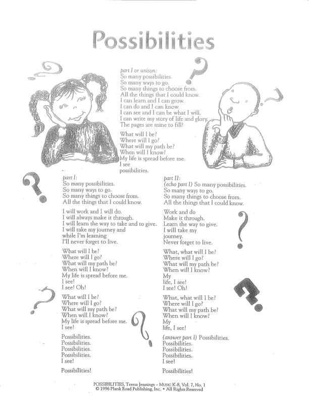

# #15 Paseos nocturnos en solitario y oportunidades

Recogimos a Mercedes del autobús cuando llegamos al campamento OSS (Outdoor Science School) y cuando la vimos con una gran sonrisa, fue el cielo.  Nos abrazó y lo primero que dijo fue: "Mamá, he hecho una excursión en solitario por la noche"... 

Recogimos a Mercedes del autobús a la vuelta del campamento OSS \(Outdoor Science School\) y cuando la vimos con una sonrisa en la cara, fue maravilloso.

Nos abrazó y lo primero que dijo fue: "Mamá, he hecho una excursión en solitario por la noche"... 

No nos dimos cuenta enseguida y ella no paraba de repetir lo mismo. Le había encantado la experiencia, pero está claro que uno de los momentos culminantes fue la "caminata nocturna en solitario".

Llegamos a casa, devoró su sopita y tanta comida que todavía me intriga saber dónde se las arreglan estos tres glotones para meterse todo lo que comen.

Nos explicó con calma, con los detalles que pueden transportarnos a los momentos vividos, todo lo que la marcó en esta experiencia.

Lo que aprendió. La cantidad de fauna y flora que encontró en la montaña. 

Lo que le gustaba y lo que no. Y finalmente la caminata en solitario por la noche:

"El último día aprendimos a orientarnos con la brújula, el sol y las estrellas, y la prueba final fue la caminata en solitario.

Teníamos un punto de partida, un punto intermedio al que teníamos que llegar, que era uno de los profesores que encendía y apagaba una luz en lo alto de la montaña como si fuera un faro, y el punto de llegada, que era donde estaban mis amigos que ya habían llegado.

Dije enseguida que no iba a hacerlo, y me sentí aliviado de que no fuera obligatorio...

Pero al mismo tiempo tenía muchas ganas de intentarlo, y tenía mucho miedo, pero quería ver si podía hacerlo o no. Y no creía que pudiera hacerlo, pero si los demás lo intentaban y lo conseguían, quería saber si podía hacerlo o no... Así que no sé ni cómo, le dije a la profesora que yo también iba a hacer el examen.

Fuimos de dos en dos al punto de partida y nos pusimos de acuerdo sobre las señales de emergencia. 

Dejamos al profesor con las instrucciones, y teníamos que subir por nuestra cuenta por la nieve, y luego bajar, pero estaba muy oscuro, y había muchos ruidos, y después de entrar en el bosque no sabía dónde iba a poner los pies ni dónde acababa la nieve y empezaba el suelo. Enterré los pies sin saber hasta donde iba a llegar en la nieve, y ni te enteras, la nieve está REALMENTE fría....

Y cuanto más caminaba, más miedo me daba... y no podía ver dónde estaban las huellas para seguirlas, ¿sabes?... y sólo quería llegar hasta mis amigos y mi profesor, ¡y no estaba segura de estar en el lugar correcto! o ¡en el camino correcto!

Y caminé y caminé, ¡y en la nieve no hay luces y apenas hay ruidos! Pero entonces se oyeron unos ruiditos y me asusté mucho, estaba temblando, ¡y no estoy segura de si fue el frío o el miedo...! Pero tampoco quería volver, así que intenté calmarme y recordar lo que habíamos aprendido, y que mis amigos y el profesor debían estar esperándome... y entonces pensé que iba por buen camino, y caminé un poco más, y en el fondo pensé que era la luz de llegada, y salí corriendo gritando que era yo, y mis amigos empezaron a gritar y a llamarme ¡MARCEIDIZ! MARCEIDIZ! y yo estaba tan feliz! Y corrí hacia ellos y me abrazaron y me dijeron ¡LO HICISTE! y yo dije: ¡LO HICE, y fue tan bueno que lloré! Pero nada triste, estaba realmente muy feliz, ya sabes REALMENTE FELIZ, no te preocupes..."

¡Qué maravilla, mi loca Cuca! ¡¿Por qué pensaste que no lo lograrías?! 

"Porque mamã, não estás bem a perceber... mas o medo, sabes, o medo é mesmo uma coisa que te vem cá de dentro, e que é muito forte e difícil de controlar!"

¡Poco sabes de lo que nos damos cuenta sobre los miedos!

Y luego toda la tarde describiendo los episodios más hilarantes, culminando con la salida para el viaje de vuelta, donde tenía unos amigos que querían meterlo todo en sus maletas y cerrarlas, pero sin éxito... y ahí iba nuestra Cuca, a hacer el equipaje de uno de ellos y cerrar su maleta.

Cuando lo consiguió, la chica le preguntó que cómo sabía hacer tan bien la maleta, a lo que Cuca dice que le contestó: "¡amiga, es que viajo mucho!..." Rodrigo y yo nos derretimos y estallamos en carcajadas ante la cómica y empoderada cara de nuestra Cuca, que era como un caparazoncito dispuesto a cerrarse a la menor molestia, y que ahora soltaba sandeces sobre cómo hacer la maleta y cosas por el estilo.

Esa tarde recogimos a Matías, así como a María que volvía del parque de atracciones Knott Berry Farm donde había actuado con el coro, y aunque, a diferencia de su hermana Cuca, tuvimos que averiguar qué había pasado con el sacacorchos, nos aseguró que le había encantado la experiencia y que le gustaría volver con sus hermanos. Los hermanos juntos y todos contentos...

<video controls src="../../media/HysgFb0sQ_yWv23JLyXAkA-1709573850-img_3602.mov"></video>

Mientras tanto, Luis y Gerry con Gabi \(más conocidos como la familia Tugo-Búlgara\) nos retaron a pasar el fin de semana con ellos en el Desierto, y aunque sólo hemos estado juntos dos veces, la buena energía y la conversación fácil en un país diferente a los orígenes de cada uno fomenta la intimidad y el deseo de compartir más experiencias juntos.

Hicimos las maletas \(Mercedes tiene razón\) y nos dirigimos a Joshua Tree, donde concertamos una recogida en un punto del parque.

Nunca me hizo gracia el desierto.

Siempre había visitado desiertos en verano, en contra de los deseos de mis padres, y lo que recordaba, aparte del aire sofocante y el viento que me quemaba la piel incluso a la \(¡escasa!\) sombra, era una superficie árida y demasiado monocroma, como una luna. En aquella época, el desierto sólo me gustaba de noche, con el cielo más increíble que he visto nunca, así que mis expectativas se centraban en socializar y conversar, más que en deslumbrarme con un paisaje tan extraño.

Bueno, me he mordido la lengua y retiro lo dicho.

El desierto en febrero es impresionante y exótico, y fue la experiencia más salvaje que hemos vivido en familia.

Nos adentramos en la inmensidad del parque en dirección al valle donde habíamos acordado hacer un picnic. No había red, ni GPS ni nada a lo que estuviéramos acostumbrados.

¡El coche estaba en marcha, lleno de suerte!

Buscamos a nuestros amigos en el valle donde habíamos quedado, pero la inmensidad del valle superaba nuestras expectativas, y sin red era inglorioso.  Nos dimos cuenta de que sólo fuera del parque podríamos comunicarnos, y así fue. 

Finalmente nos reunimos a última hora de la tarde en una de las veladas más cómodas que hemos vivido por estos lares.

Hacer nuevos amigos de adulto no parece ser tan fácil, pero quizás por las circunstancias, quizás porque hay tantas cosas en común, quizás porque son personas tan interesantes, y quizás porque realmente tenemos mucha suerte con quien nos encontramos, hemos encontrado en esta familia un abrazo maravilloso.

Intentaré mantener mi abrazo abierto para seguir haciendo amigos así.

<video controls src="../../media/Niud41gmQDWBxpXyHRAQNA-1709523815-img_3782.mov"></video>

<video controls src="../../media/IEQobR09RemzXosVDwf9RQ-1709523839-img_3781.mov"></video>
Al día siguiente, primera parada: presentar los folletos de Junior Ranger, hacer el juramento de proteger la naturaleza y recoger las insignias. 

<video controls src="../../media/c8JNUpsTRbK3wxEj4IUleQ-1709525165-img_3784.mov"></video>
Listos para la excursión de un día, con un picnic recién hecho en el glaciar, mapas de papel en la mano y sin perdernos nunca de vista, nos adentramos de nuevo en la inmensidad del desierto, con la esperanza de encontrar el jardín de cactus.

Me di cuenta de que no tener red ni GPS, no saber dónde estamos en una pantalla, no tener innumerables carteles con nombres de calles, flechas y direcciones, no saber a qué distancia está nuestra salida o dónde tenemos que girar en la inmensidad del paisaje, es algo que nuestros hijos no sabían en absoluto. Y que nosotros ya no recordamos.

Después de estar casi seguros de que nos habíamos perdido, encontramos el jardín de cactus \(imposible perderse, había millones de cactus hasta donde alcanzaba la vista\) y merendamos entre ellos.

<video controls src="../../media/Msy2pajQTvWt2JvY3C8HWQ-1709525432-img_3861.mov"></video>
Fue una experiencia salvaje y hermosa a partes iguales. Y es de agradecer...

Pasamos por los puntos más emblemáticos de este desierto que se ha convertido claramente en mi desierto favorito \(aunque, dados mis antecedentes, no parezca tan increíble, lo es\) y contemplamos una puesta de sol que también perdurará en el recuerdo.

Nos despedimos de nuestros amigos al final del día y regresamos a Seal Beach con el corazón lleno.

Los días siguientes fueron todo un reto...  Semana de nieve para los chicos haciendo novillos en casa, con sus padres trabajando. Afortunadamente, conseguimos organizarnos y nos dirigimos a las montañas al final de la semana. Suena raro después del desierto, pero juro que el itinerario es el siguiente... Salimos de casa de espaldas al mar, pero con olor a mar. Todo recto hacia el desierto, pero antes giramos a la izquierda y nos dirigimos a la nieve. 

Tanto el desierto como la nieve están a 2 horas de nuestra playa. Si eso no es un privilegio, no sé lo que es. Amigos de los niños equipando a toda la familia para esta experiencia y ¡allá vamos!

Los niños ya han aprendido el oficio, y nuestra Mel, que unos días antes había estado suspirando en tierras cálidas, se vino con nosotros para vivir otra experiencia. No le falta mundo en su pequeño cuerpo, y ha aprendido a viajar con sus dueños...

Nuestro Matías es el relaciones públicas de la familia, y gracias a él nos acompañaron los padres de su mejor amigo y sus cuatro hijos. Preveíamos un fin de semana bastante aburrido, ¡pero resultó ser sencillamente espectacular! Más apertura para abrazar a más amigos y crear bonitos recuerdos.

Nuestra cabaña patusca era muy cálida, y aunque teníamos más camas que personas, encontramos el dormitorio de los niños en la salsa, ¡y estuvo bien!

El Oso de Montaña es realmente precioso. Y como la última vez que fui con raquetas de nieve me fracturé el codo, me entraron temores de insomnio y decidimos hacer la aproximación sólo con el culo para ver cómo era....

<video controls src="../../media/RSp79lCuTlSDsju50TEaSA-1709623465-img_4143.mov"></video>
Entonces descubrí que el segundo nombre de mis tres hijos es el mismo: Kamikaze. 

Grité hasta quedarme afónico CUIDADO tantas veces para que todo el mundo se diera la vuelta y no atropellara a nadie. Pero hubo tantas risas buenas que nos quedamos \(¡muy!\) chafados, pero con el corazón lleno. Prometimos a los ninjas volver a los lados bacheados de las pistas en su próximo viaje, ya que parece que han vivido con la nieve toda su vida.

Aparte de la diversión, estamos deseando volver aquí en verano. El paisaje promete...

Los chicos han vuelto al colegio con más seguridad de que lo que realmente les gusta es estar de vacaciones. ¡En el juicio! Y así fue. La semana se abrió con la noticia de que Matías había sido convocado simultáneamente para las dos modalidades de fútbol que ya conocemos.

La primera sesión de entrenamiento fue con el equipo LA Chargers \(me controlé para no reirme con su entrenador, que por lo visto se toma muy en serio el nivel sub-6\), y le expliqué que Matías no sólo no tenía ni idea de las reglas del juego, sino que además venía de un país donde el fútbol se juega obviamente con los pies. Se rió y se llevó una mano a la frente. Yo olía cierto pánico por el partido que iba a tener lugar dentro de dos días.

Sin embargo, el panorama mejoró cuando Matías hizo el primer lanzamiento y el entrenador, aparentemente mas contento, me habló de la posición de Quarterback.

Le contesté que no tenía ni idea de lo que decía, pero que estábamos abiertos a las posiciones en partidos desconocidos, y volvió a llevarse la mano a la cabeza...

<video controls src="../../media/Ql541UjFRCaCQaGFkZqHOg-1709529104-img_4331.mov"></video>
El único problema... Tienes que correr en este juego...

Y mi querido hijo corre muy rápido, pero con los brazos abiertos en dirección a su mamá. 

Esto explica el alboroto que armamos nosotros y otros padres cuando Matías y compañía corrieron en la dirección correcta en el partido de esa misma semana \(después de un entrenamiento\).

<video controls src="../../media/SuWE1oJZRFqAQypC7FZLsA-1709625022-img_4376.mov"></video>
Perdieron su primer partido a lo grande, pero se chocaron los 5 como si hubieran ganado. Y se lo pasaron en grande.

Al día siguiente debutó en el fútbol. Cualquiera que conozca a Matías sabe que se le dilatan las pupilas cuando ve un balón, así que en este caso somos más optimistas, y los entrenadores no se llevaron las manos a la cabeza.

Las hermanas de casa, que no paran de cantar estos días, estuvieron especialmente activas al unísono preparando el Festival Coral Destrital.

No recuerdo si ya lo he dicho, pero en este distrito, el Coro es realmente la cosa más guay a la que pertenecer, y las hermanas se unieron y les encanta.

Inauguraron el festival con la música que habían ensayado resonando de un baño a otro con el agua caliente corriendo... Varias veces les dije poco delicadamente...

Callaros!!!! y Daros prisa!!!

Al final cedí y les pedí la letra.

Si este mensaje no nos llegó a propósito, parece.

<video controls src="../../media/R18KzNGTRvOOD9xwBWloyg-1709626496-img_4447.mov"></video>
Que en todos los paseos que parecen en solitario y de noche, consigan organizarse para centrarse en las personas que nos acompañan y que gritan por nosotros...

Que en cada desconocido puedan ver oportunidades para conocer amigos...

Que se diviertan en todos los retos.

Y que recuerden siempre que las posibilidades son infinitas.
