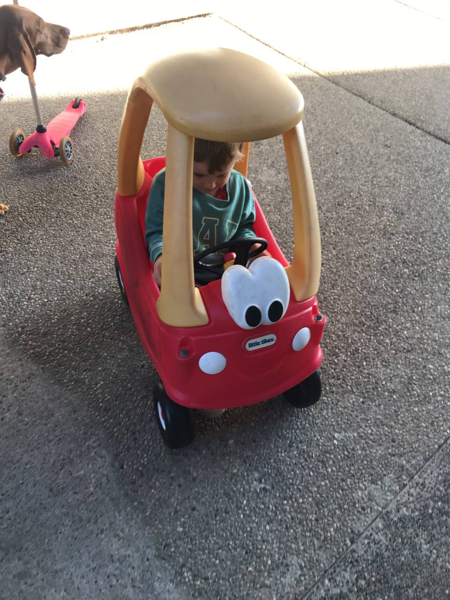

# #6 Los nuestros

Esta semana Rodrigo cumplió 45 años.

Esta semana Rodrigo cumplió 45 años.

Las niñas fueron a nadar y luego nos unimos a la fiesta "bye Summer" que organizó el condominio. Aunque la comida estaba hecha en un bus, tengo que confesar que estaba deliciosa. La comida mexicana que encontramos en el sur de California, incluso en formato Street Food, es francamente mejor a la que estamos acostumbrados en nuestro rinconcito. 

Sólo les faltó poner cubiertos o platos indeformables y hubiera sido "La bomba". ¡Vivan las servilletas! Hay que adaptarse.

Así que, aunque no fue posible comer paella o bacalao como de costumbre, todos nos quedamos con la boca ardiendo de "panza llena y corazón feliz".

<video controls src="../../media/73696747-1695778450-img_9440.mov"></video>
Nos acompañó en la cena un querido vecino, californiano de nacimiento, pero con mucho mundo en el cuerpo. Creo que esto del mundo en el cuerpo es una de las experiencias más transformadoras y bonitas para cada uno de nosotros, me parece que hace a la gente más empática, tolerante y claramente muy interesante. 

Conversación fácil y una tarde divertida, eso fue lo que pasó. Y aunque no pudimos darle abrazos de todos los nuestros Rodriguito \(creo era lo que más le apetecía\), entre las tres conseguimos preparar una tarta que sabía a casa.

<video controls src="../../media/73696744-1695778423-img_9446.mov"></video>
Cuando le sugerí una tarta de queso americana recomendada por los lugareños que conozco, torció la nariz y pidió sabores conocidos. Y así fue.

El resto de la semana transcurrió con los frentes habituales, y Matías cada vez más auténtico en inglés. Nos corrige la pronunciación de las palabras "Mami, no es chárc, es shark", en impecable americano.

Ayer estaba jugando con otro niño en el patio y de repente le oímos decir: “C’mon bro, this way, this way! throw it to me!”. Y con cada nueva frase, es una toma de conciencia increíble.

A veces, cuando el insomnio y la morriña golpean, intento centrarme en lo que nos dicen los nuestros. 

Que la experiencia y la educación son los mejores activos que se pueden tener, aún a costa de cierta libertad económica \(Miguel, gracias, duermo mejor desde que hablamos ;\)\), aunque sea por el nuevo idioma aprendido sin traumas ni esfuerzos, al menos para uno de estos cinco... ya ha merecido la pena.

En una de las reuniones de padres a las que asistí, me explicaron que los colegios a los que van mis hijos son Blue Ribbon schools, lo que significa la máxima distinción en educación, civismo y deporte. 

En cuanto al civismo, se nota enseguida la diferencia: premios a la empatía, distinciones por actitudes agradables en el patio, voluntariado en la comunidad \(cuando participemos en el primero, os lo contaré\).

En deportes, María, que hace educación física todos los días, dice: "Nunca he corrido tanto en mi vida, ¡me duelen tanto las rodillas!" Sea lo que sea lo que tengamos que hacer en cada clase, siempre empezamos dando tres vueltas al campo \(¡que es un campo con césped enorme!\).

En educación, mantener Blue Ribbon durante tantos años significa un trabajo constante. En otras palabras, si con todo lo que se facilita en el proceso de aprendizaje, los alumnos obtienen un rendimiento inferior al 70%, sus profesores les proporcionan apoyo adicional a una hora programada \(antes de que empiecen las clases\). No se llama apoyo para nada, está organizado desde el primer día, y se llama periodo cero.

María empezó a asistir a clases de inglés para internacionales en el periodo cero para poder integrarse rápidamente. En la actualidad, aprovecha el periodo cero para aclarar dudas de deberes, o para clases de baile a las que puede apuntarse, porque en su último examen de inglés superó la nota que necesitaba, y ya no es obligatorio asistir a este periodo. Así, antes de que empiecen las clases a las 8.30 horas, el periodo cero ofrece un apoyo variado para cada circunstancia.

En el caso de Mercedes, como tiene mayores dificultades de comprensión lectora, el colegio ha puesto a su disposición un profesor de lectura sólo para ella, 20 minutos al día, todos los días menos el miércoles, que sale temprano. Ayer, después de clase, me dijo: "Mamá, por primera vez en mi vida me doy cuenta de que las letras inglesas suenan de forma completamente diferente a las portuguesas o españolas. Me ha dicho que la profesora: te ayudaré a descifrarlas. Es como otro alfabeto".

Y efectivamente, aunque suene extraño, los profesores que tuvo en el instituto de español eran siempre no nativos. Y la pronunciación de los sonidos en un inglés "españolizado" le hace un nudo en la cabeza, según ella.

De momento puede conversar aparentemente sin esfuerzo y sin acento. Pero si tiene que leer y escribir, es otro reto. Dicho esto, la profesora de Mercedes me ha dicho que durante las clases, para darse prisa y llegar al patio, deja de traducir todo el rato con el programa que tiene en el ordenador, y ya se está aventurando a contestar directamente en inglés.

Mucha suerte a la profesora de lectura, espero que con su preciosa ayuda algún día pueda ser audiolibro por elección, y no por obligación diaria, para que mis hijos puedan entender lo que se les pide  en los problemas de matemáticas, en la poesía o en las novelas.

También creo que ya ha merecido la pena por otro aspecto que están sintiendo mis hijos. Esta integración de todos los niños, y el apoyo para que se integren y consigan todos los resultados esperados, es algo nuevo. Sin tener que firmar un documento antes de empezar el curso \(por primera vez en 10 años\), diciendo que entiendo y acepto \(LOL\) que si mis hijos tienen un rendimiento o comportamiento desviado en el aprendizaje, se nos invita a buscar alternativas. En otro colégio.

Ser capaces de integrarse y brillar con más o menos trabajo, más o menos ayuda, es algo que quiero que retengan de por vida. Ha merecido la pena...

Sin ánimo de parecer injusta, confío más en esta clasificación integradora de Blue Ribbon que en la segregadora que pactamos y firmamos documentos cada año. Y que arroja a los colegios públicos de la península a lo más bajo, no a lo más alto.

Por lo demás, la vida sigue, Maria Joana toca prácticamente todas las noches, alternando con Sweet, Deolinda, Márcia, Salvador y Quatro e Meia, en bucle.

<video controls src="../../media/73696759-1695779316-img_0092.mov"></video>
En nuestros viajes nos las arreglamos para meter 3 bicicletas, 5 personas, compras, mochilas y demás, ¡y llegamos a nuestros destinos todos impecables! 

Las noches de los viernes de septiembre siguen siendo en la playa, y es un programa del que incluso Mel es fan.

<video controls src="../../media/73696761-1695779474-img_0096.mov"></video>
Además, nuestra casa de Seal Beach se está convirtiendo cada día más en un hogar, ¡gracias también a la rotación de vecinos que dejan al aire libre lo que no pueden o no quieren llevarse a nuevos hogares!

Y mis hijos están encantados con estas ventas diarias de garaje a coste cero.

El fin de semana me trajeron a casa un cuadro estilo Sporting, pero en lugar de ser de un verde precioso era más bien oscura. De sorpresa, con las tizas, lo cambié un poco para incorporar el lema del colegio de María. ¡Les encantó!

Hoy estoy escribiendo en el avión a Toronto, para presentar por primera vez en ICS2023, con los máquinas más respetuosos que conozco en Ginecologia y Obstetricia.

Parece increíble, pero me costó mucho dejar mi casa y con mis todo en otro país, sin la red de los nuestros. Y me revolvió el estómago. Literalmente.

Entre familia y amigos tengo que decir que tengo la mejor red que existe.

Y esta experiencia sólo sería espectacular si los tuviera cerca todo el tiempo. Es un precio muy alto. 

¡Vamos Rodrigo! ¡Prometo aprovecharlo al máximo y hacer valer la gimnasia de un padre de 3 hijos y una Mel!

Solo, en California... ¡glup!

Hasta pronto.
