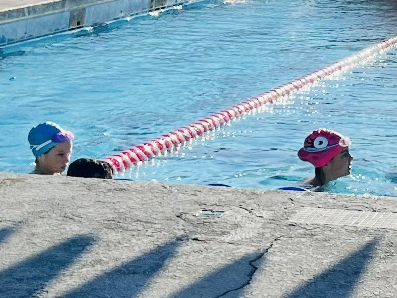

# #4 Enjoying the ride

Quando aterrámos depois de termos conseguido embarcar nesta aventura, e fomos tentando contornar os desafios que nos foram aparecendo, a preocupação e a respiração em suspense tornam-se uma constante.

Quando aterrámos depois de termos conseguido embarcar nesta aventura, e fomos tentando contornar os desafios que nos foram aparecendo, a preocupação e a respiração em suspense tornam-se uma constante. E às tantas é uma sensação tão familiar que transforma o aproveitar do presente em modo contido. É um propósito tentar reverter este ciclo de contenção, confesso. Penso que a rotina pode ajudar, e o resto também.

Os manos continuam a despedir-se de manhã como se fossem cada um deles para uma missão difícil, e é bonito e desafiante de ver nas mesmas proporções. 

Além da rotina que se vai instalando tivemos nestes dias reuniões de pais onde percebemos a dinâmica, e que o sistema americano estimula e bem, desde cedo o trabalho autónomo, com tempo previsto para o trabalho em casa.
Fiquei um bocadinho aturdida com a quantidade de informação, mas muito bem impressionada.

Assinámos um contrato com a Maria e a tutora. Consta: o que é esperado; as penalizações respectivas; as consequências da acumulação de penalizações: mais de 10 acumuladas durante o ano - e não participam na viagem de finalistas, na cerimónia de graduação ou em tudo o que surja de divertido no final do ano. 

Penalizações são por exemplo atrasos na entrega de trabalhos, faltas injustificadas, uso do tlm dentro da escola, etc. Não é nada relacionado com classificações finais em testes ou trabalhos, é basicamente o desempenho durante o percurso.

Com a Mercedes a professora tem uma dinâmica diferente.

A Mercedes dizia que a prof lhes pagava pelo bom trabalho. E que um amigo devia "ten bucks" à prof, porque deixou os lapis todos espalhados e foi para o recreio sem arrumar. Percebi na reunião de pais que era mesmo verdade. 

Há notas coloridas de 10$, 20$, 50$ e 100$ que são entregues aos alunos consoante o que fazem na escola. Mais uma vez, nada que ver com as classificações em testes ou trabalhos, mas sim com o desempenho. Participam, chegam a horas, têm o espaço limpo, calam-se quando devem, trabalham quando devem, recebem notas. Chegam tarde, querem ir a WC no meio da aula e já não têm free pass \(recebem 4 free pass por mês para gastar em idas à vontade à WC\), esquecem de entregar trabalhos atempadamente, etc, pagam. 

Claro que já ouvi criticas ao sistema "estilo capitalista" quando partilhei alegremente o que se estava a passar. No entanto estava habituada a existirem prémios na escola dos meus filhos relacionados com comida - gulodices! Acho este mais útil e real, e sem dúvida mais saudável! No caso do Matias o esforço também é recompensado, está visto. Posso dizer que uma das expressões mais frequentes desde que entrou nesta escola é "Good Job!" e "Ohhh so nice!" Penso que os prémios ainda são só verbais. Aguardemos.

Na reunião, uns pais na turma da Mercedes perguntaram, "e se eles ficarem sem dinheiro? alguém lhes empresta com juros?" A prof respondeu, sem se alterar, "podem pedir emprestado, claro, mas é raro conseguirem, pois os colegas percebem que eu financio com facilidade. Se ficam sem dinheiro é porque estão permanentemente a faltar ao esperado, sem conseguir recuperar, quer dizer que não estão a tentar melhorar de todo. Ninguém quer um teamate que não se esforce, nem tente recuperar uma baixa performance, na sua equipa. Espero performance, não resultados, esses chegarão mais cedo ou mais tarde com a constancia e a disciplina do trabalho."

Não sou pedagoga, mas como mãe acho que vou começar a premiar e a fazer pagar multas por baixo desempenho e falta de disciplina cá em casa. Logo vos conto se tenho filhos edividados.

A prof diz que desde que implementou o sistema todos se lembram de ir a WC no recreio e se esforçam por ter sempre tudo arrumado. Ninguém gosta de perder dinheiro tontamente. No fim do ano há um evento na escola onde trazem o que já não brincam/usam de casa para uma especie de "feira da ladra", e compram aos colegas com o dinheiro acumulado, o que lhes interessa. Trazem junk para a escola, e compram junnk dos outros colegas. Aí é um fartote de cálculos e de trocos e inclusivamente de empréstimos. Gostava de ser mosca.

Sempre fui apologista de acompanhar os filhos no estudo e trabalho em casa pelo rabinho do olho. 

Nuns filhos mais fácil que noutros, numas disciplinas mais fácil que noutras, mas continuo a defender a ideia de serem autónomos nas suas responsabilidades.

Aqui ainda não pode ser assim, para já..
Tempo estimado de TPC: 45min para a Mercedes e 1h30 para a Maria. Tendo em conta os horários de saída da escola, parece bem adequado. Não fosse a oralidade instalar-se muito mais rapidamente que a leitura e a escrita. Fico abismada com o vocabulário dos meus 3 filhos em tão pouco tempo, mas a velocidade de leitura e escrita ainda não acompanha a facilidade com que conversam em inglês. E por exemplo na matemática outra dificuldade é ter medidas, e terminologia completamente diferente. E os pontos e as virgulas de números decimais serem exactamente ao contrário do que estávamos acostumados. E neste momennto em vez do rabinho do olho, a mesa da sala parece um campo de batalha em que tentamos sempre com a ajuda do traductor perceber exactamente o que se lhes pede. E fica um de nós no meio delas feito polvo a tocar em todas as frentes e a traduzir daqui e a explicar acolá. Para que levem tudo entendido e feito no dia seguinte.

Confesso que quando acabo o meu turno de responsabilidades na Universidade e começo o turno de apoio aos TPCs até tiques nos olhos tenho tido. Demoramos muito mais do que o estimado, claro está, mas elas vão mais confiantes para a escola depois de lhes termos esclarecido as dúvidas em casa, sobre o que não entenderam na escola, e com tudo bem feitinho no dia seguinte. Mas a rotina vai-se instalando. E chega as 21h e estamos completamente KOs. 

No meio desta dinâmica achei que era boa ideia dar uma palavrinha na piscina da escola da Mercedes uma vez que só tinha conseguido inscrevê-la para lista de espera das aulas de natação para 10 anos. O Rodrigo também achou boa ideia e lá fui tentar a sorte.

Expliquei ser eu própria fã deste desporto, e que as minhas filhas nadaram desde os 6 meses até a pandemia se instalar. E uma das senhoras que ouviu a nossa conversa disse, "quero vê-las a nadar, às duas, sff." Achei simpatico o interesse súbito, e pensei que iam meter uma cunha para as integrar às duas nas aulas de natação. Levei-as no dia seguinte a achar que iam fazer umas piscinas tipo teste a ver se não se afogavam, para poder frequentar as aulas.

A Coach Shelly reconheceu-me, apresentou-se às manas, e disse-lhes lhes ia buscar óculos. Pensei que o teste era mais sério do que o inicialmente previsto. E a seguir foi uma mãe portuguesa a traduzir distâncias para dentro de água, e duas manas de olhos esbugalhados com uma coach a gritar: "great job! but when I say 100 yards keep going until you finish, don't stop!" "100 yards?? What???" Calculei no traductor a correspondência em metros, e gesticulei que correspondia a 4 piscinas \(pouco mais que 90m\), e que pelo amor da santa não parassem na parede. Elas responderam gesticulando que essa parte tinham percebido.

Resumindo não estão a frequentar aulas de natação da escolinha da Mercedes, entraram directamente para a equipa estatal de Seal Beach, e levam uma sova 3x por semana numa piscina aquecida ao ar livre. Saem contentes, ao menos isso!

Na última aula a Mercedes não precisou de ajuda na tradução, disse claramente à coach Shelly que lamentava mas "my arms don't work anymore, I really need a break." E a coach Shelly anuiu e deu-lhe "30 secs of break for Mercedes". Uma querida!

Quando terminam o treino eu também respiro fundo e já me perguntaram se tenho mais filhos nadadores. Respondi que só filhos ninjas, mas que se for para lhe dar uma sova na água também o levo à piscina. Escusado será dizer que nos dias de natação é uma verdadeira maratona para chegar a todos os lados e pôr tudo na cama antes das 21h. 

Nesta dinâmica sempre a tentar corresponder ao que está a ser pedido, e como não temos termos de comparação, não sabemos de facto o que esperar quando é dia de saber resultados. Então num dia destes a Mercedes apareceu com ar comprometido, e disse, "mamã, não percebi bem o que me aconteceu hoje", e claro, mente de mãe preocupada e de descontracção contida,  entra em modo suspense... e ela mostra o prémio mais cobiçado de toda a aula com uma nota da professora a acompanhar. A mãe, claro descompôs-se.

O que não percebes Mercedes?? e ela, "eu acabei de chegar, sou a mais lenta de todos a acabar os trabalhos, às vezes não me percebem e eu não os percebo, sobretudo se está escrito o que me querem dizer... Como é que eu é que ganhei o prémio RAH Mcgaugh?? Achas que foi engano??" 

Expliquei melhor, mostrei-lhe o nome dela no papel, e ela confirmou que o leu várias vezes antes de se atrever a enfiar o prémio de plástico que vale ouro na mochila, mas também se emocionou quando lhe expliquei exactamente o que a "professora capitalista" que já a topou inteira lhe tinha escrito.

Viemos para casa a tentar baixar a guarda em relação à descontracção, chega a Maria uma hora depois. "Papá não percebi as minhas notas que recebi hoje. Aqui as percentagens vão até quanto?? Eu achava que 100% era o máximo, mas tive alguns 100 e picos, se calhar não tive boas notas como antes..." Fomos investigar, aparentemente pode ultrapassar se fizer tudo certo e completar os bónus. "Maria, fizeste algum bónus? "Ah, havia uma parte que dizia bónus, e eu fiz tudo o que me apareceu, achei que bónus era uma coisa boa." Teve quase tudo A\+, e a mãe descompôs-se outra vez. Acho que o pai também, mas disfarça melhor.

Fomos buscar o Matias e a Miss Megan que tinha sugerido a construção de um tesouro "Safe spot", elogiou o nosso trabalho e disse que o Matias não só explicou detalhadamente quem eram cada um seus tesouros, como durante o dia pediu para ficar só sossegado a apreciar o livro que lhe fizemos, e a dizer os nomes baixinho de cada um que lhe aparecia nas fotos. E a mãe, coitada, a esta hora já parecia uma autêntica carpideira.

Tudo no mesmo dia!

Nos dias seguintes tivemos uma Ice-cream party na escola da Cuca, às 18h depois do jantar, com as profs a servirem gelado e as crianças a brincarem no recreio da escola. Encontramos um dos casais que já tínhamos conhecido na festa da filha da Jenny, e que nos pediu para conversarmos sobre esta experiência de viver noutro país com a família toda, pois estão a preparar-se para fazer exactamente o mesmo dentro de 2 anos em Espanha. 

Recomendamos Valência, obviamente. E estivemos à conversa um bom bocado.

Às tantas a mãe, que é prof Inglês e Teatro, perguntou se precisávamos de livros, e eu expliquei que temos tudo oferecido pela escola, menos a leitura de 40 livros para a Mercedes, \(1 livro por semana durante 40 semanas - fica para outro post as tarefas associadas à leitura de livros\). Disse-nos que passássemos lá em casa no dia seguinte, e fomos buscar à biblioteca pessoal dos filhos e alunos dela, o que lhes apeteceu trazer aos meus filhos.

Este desprendimento dos bens físicos e a generosidade vinda de desconhecidos que conseguem empatizar ao ponto de perceber o que precisamos, e disponibilizar-se para ajudar de variadas formas é a mais bonita das aprendizagens até agora.

Regressaremos a casa certamente mais ricos, apesar de provavelmente descapitalizados.

 No fim de semana decidimos ir à praia, Bolsa Chica, \(praia boa com musica ao vivo o dia todo\) e além do que nos foram oferecendo na comunidade, o Colin e a Jenny \(supostamente minha chefe, mas que cada vez mais me parece uma amiga querida\), acabaram de nos equipar com sombra e outros apetrechos, e emprestaram o "passe de estacionamento" para aceder gratuitamente a qualquer parque ou praia. Lá está, ver gente a gastar dinheiro tontamente ninguém gosta.

E assim fomos preparadíssimos passar um dia de praia maravilhoso. Bolsa Chica é bom, mas as meninas adoraram Huntington Beach, pelo ambiente e energia surfista que cheira um bocadinho a casa.

<video controls src="../../media/70455400-1694029943-img_8928.mov"></video>

Quando chega a sexta feira mudamos de facto o chip, e parece que nos dias de descanso estamos efectivamente de férias. Este fim de semana fomos ao Paul Getty Museum, e foi bom voltar quase 25 anos depois e perceber que está igualmente bonito, com vistas incríveis e recheadinho de obras magníficas. Só na ala europeia, na mesma sala estavam: Monet, Manet, Degas, Van Gaugh, Goya e Sorolla. Completamente gratuito para que a arte e o conhecimento cheguem a toda a gente.

E no dia seguinte regressámos à Lego. O Matias sempre que encontrava os folhetos e os mapas do parque nalgum lado, fazia todos os esforços e em várias línguas, a tentar explicar que queria voltar àquele parque, que gosta muito de legos. E por sorte, no bilhete que comprámos tinha entrada para dois dias diferentes. Com acesso ao aquário e aquaparque, tudo da Lego. Foi a loucura. 

A única parte menos boa é que o Matias que vai sendo fluente nas 3 línguas diz claramente que quer vir a este parque todos os dias. Everyday, ok?

<video controls src="../../media/70461051-1694041221-legoland-3-sep-2023.mov"></video>
No meio destas aventuras conseguimos encontrar um vendedor de bicicletas de 2ª ou 5ª mão \(who cares?!\), e já conseguimos adquirir beach cruisers suficientes para nos deslocarmos todos em bando por Seal Beach. 

Espero que consigamos fazer muitos percursos nas ditas, e que a contenção vá dando lugar ao espirito laid-back e easygoing que caracteriza os Californianos tão bem.

Prometo esforçar-me por aprender isto com eles.

Amanhã a Cuca tem o primeiro teste de matemática. Está aqui ao meu lado de dentes serrados a fazer exercícios.

Eu estou a tentar relaxar a minha mandíbula e a focar-me no que me tem dito o Rodrigo e tenho prometido a mim própria: enjoying the ride.
