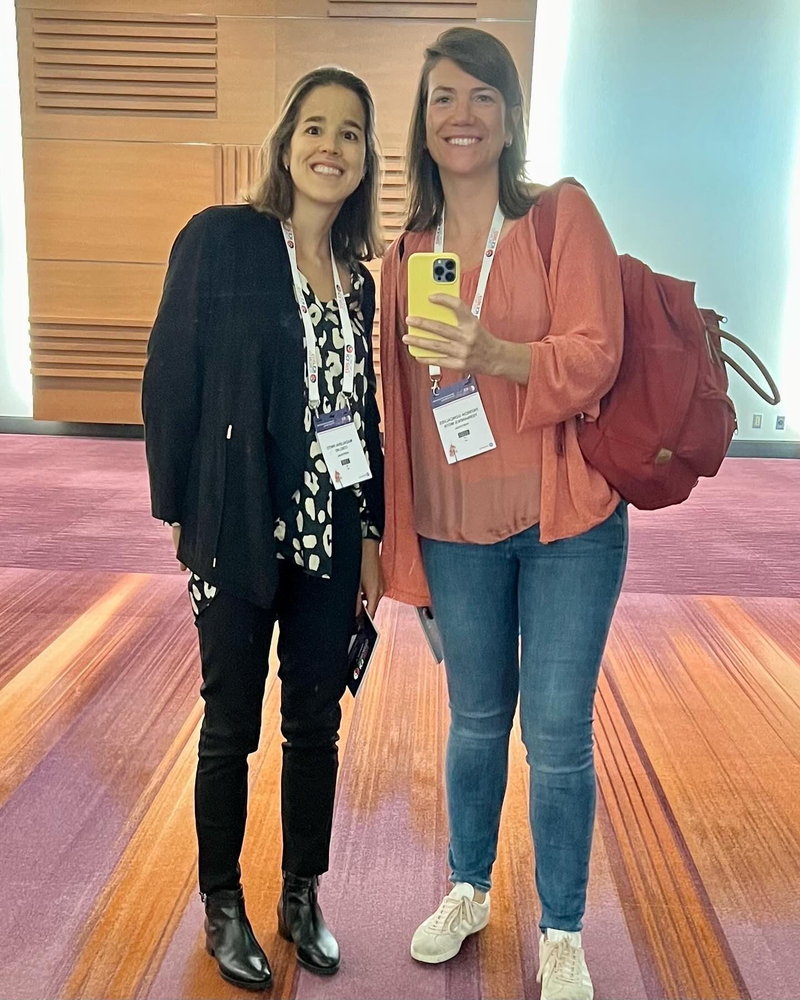
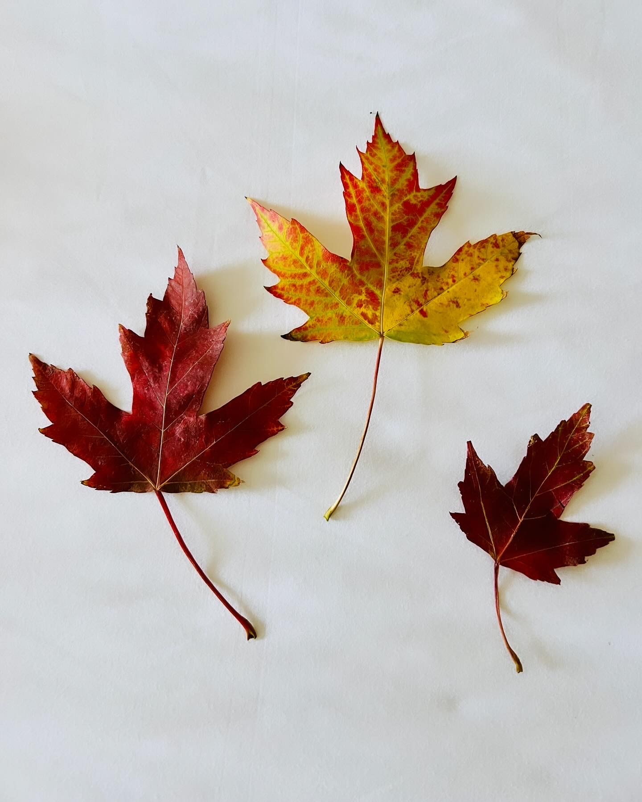
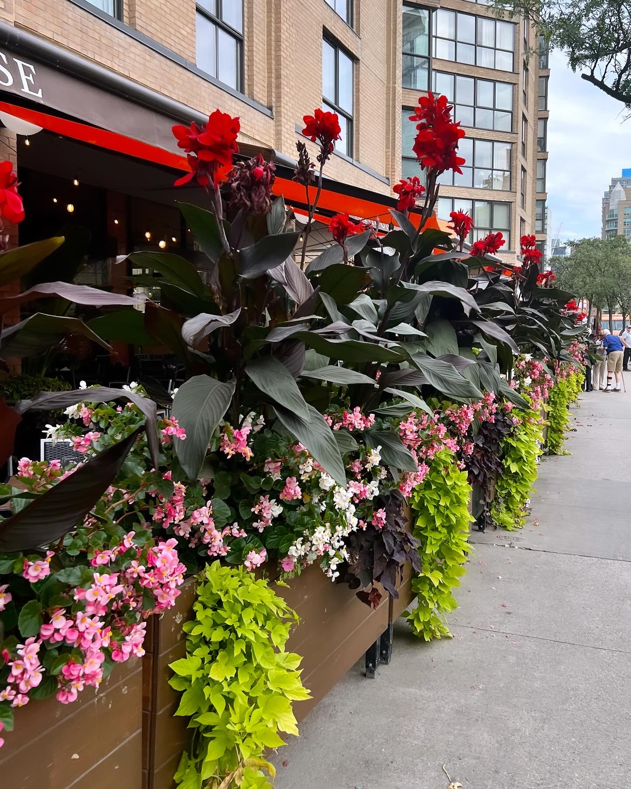
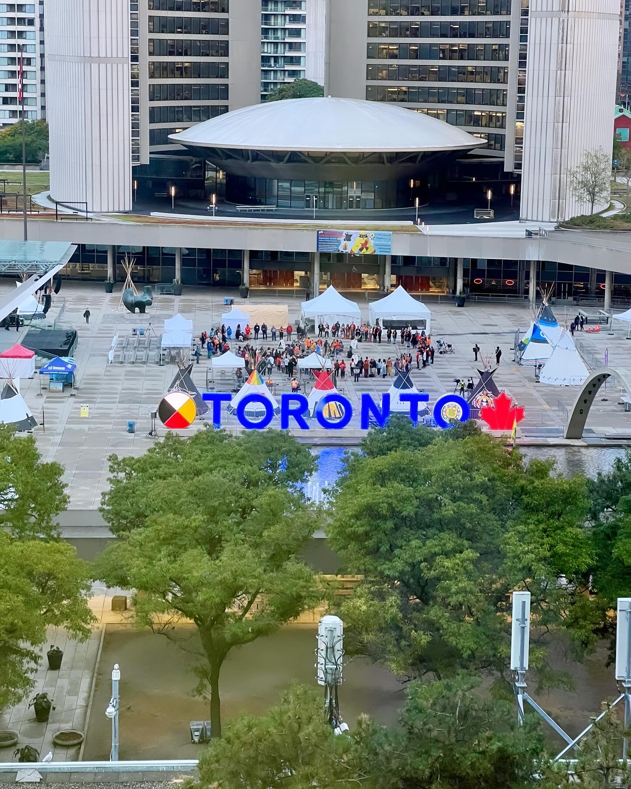

# #7 dias não

E quando a videochamada chega de repente do outro lado, e se torna real a saudade de um abraço apertado, de uma conversa sem pressa e sem hora marcada, pede-se desculpa pela rapidez a desligar, pela descompostura, ou pela choradeira a olhar para um ecrã no meio da rua.

Nos dias não, não apetece escrever.

Nem apetece propriamente engolir em seco ao telefone ou em videochamada, por isso evita-se a videochamada.

E quando a videochamada chega de repente do outro lado, e se torna real a saudade de um abraço apertado, de uma conversa sem pressa e sem hora marcada, pede-se desculpa pela rapidez a desligar, pela descompostura, ou pela choradeira a olhar para um ecrã no meio da rua.

E por deixar do outro lado encolhido quem nos quer aligeirar a pressão, e tenta de todas as maneiras chegar aqui perto. Desculpem a semana passada.

Não apetece muito escrever sobre dias "não", mas eles existem também por estes lados e são muito reais.

Dias "não" de privilegiados, claro está, que estes dias "não" são detalhes, no meio de problemas sérios de saúde, ou como os que nos entram diariamente pelas notícias. E que nos dão voltas ao estômago, e que nos põe a falar com amigos de longa data que vivem em Israel, e nos fazem ficar de coração estrangulado quando recebemos notícias na primeira pessoa desde lá... 

As meninas perguntam coisas óbvias "Mais outra guerra? Mas agora quem é que se lembrou disto?" Confesso que me perdi há muito tempo neste conflito, mas estas *Breaking News* cheiram a terrorismo descontrolado, dos que dá vómitos a sério, e que em primeiro lugar destroem famílias inocentes. De um lado e do outro.

E elas ouvem a explicação, e continuam como todos, sem compreender.

Mas os nossos dias "não" são nossos, e à nossa escala. E também têm direito a escritos.

Não temos problemas graves ou sem solução, mas quando se juntam vários cenários que não previmos nas 327 madrugadas de insónia, e nos testam os limites todos ao mesmo tempo, evito escrever. 

Mas mesmo nos dias mais difíceis há espaço para acontecimentos incríveis, e é disto que este sitio para dar notícias se trata. Dos relatos de dias de acontecimentos incríveis, sim, não e mais ou menos.

Em Toronto foi top. Em vários sentidos. De intimidade com uma ex-aluna, ex-orientanda, actual-colega/amiga/confidente. A Madalena querida, com quem Toronto foi muito mais bonito em modo partilhado.

Houve espaço para encontros e conversas com colegas/amigas de longa data, projectos futuros, apresentações excelentes, questões pertinentes, interesse pelo trabalho que desenvolvemos, e muitos contactos. Antevejo coisas bonitas a acontecer para o futuro.

Depois das nossas apresentações corri para o aeroporto. Tudo a horas e entrei no avião para dar de caras com o meu meio sítio disponível para me sentar entre dois lugares.

À janela uma senhora tão grande que ocupava o sítio dela e quase metade do meu, com o repousa braços que nos separava os assentos levantado, e  impossível de baixar. E um senhor sentado no lugar do corredor a olhar para mim a dizer com os olhos, "boa sorte no Tetris".

 O voo completamente cheio, impossível de encontrar alternativa. Com todo o cuidado enfiei o meu 1,78m no micro-espaço que estava disponível, sem querer colar o meu rabo à senhora, nem me sentar literalmente ao colo do outro senhor do corredor. Impossível evitar ambos.

Nos primeiros 20 min mantivemos a cerimónia entre 3 estranhos sem espaço vital. Depois a senhora adormeceu, relaxou e ainda me empurrou mais para cima do outro senhor. Desculpei-me quase ao colo do senhor, que quando percebeu o meu accent não nativo, começamos uma conversa tão gira, que o voo de quase 5h esborrachada entre estranhos, depois de ter estado o dia todo em congresso, foi das coisas mais prazerosas que me aconteceram dentro de um avião.

O senhor era um professor sénior de direito, da costa Este, a viver e a dar aulas na California há mais de 15 anos. Personagem interessantíssimo e interessadíssimo em saber das nossas aventuras.

Quando veio o hospedeiro lembrar que a sua reserva incluía jantar \(ao contrário de mim que optei pela tarifa mais básica\) ele confessou que era a Universidade que lhe fazia as reservas, e que ele nem se lembrava de ter sido pedida refeição.

Então, apesar de termos os dois jantado antes de entrar no avião, vimo-nos não só esborrachados durante 5h, como também a partilhar experiências de vida, e uma travessinha de queijos, fruta, frutos secos e chocolates em amena cavaqueira. No fim do voo, depois de me ter dado imensas dicas de possíveis dias incríveis, sabido o que nos trouxe e o que penso levar desta aventura, apresentado o neto, e explicado a sua visão política deste país \(notei que sendo professor lhe foi fácil trocar-me por miúdos um sistema tão diferente do nosso\), despedimo-nos até sempre. Fiquei com a sensação que nenhum de nós se atreveu a partilhar o contacto, e hoje tenho pena de ter cedido à timidez.

Entretanto como em todas as viagens, uma das melhores partes é regressar a casa, e quando me vi de novo com a troupe, foi mesmo maravilhoso.

O Rodrigo não só se aguentou à bomboca dos pratos todos a girar, como toureou birras sem precedentes do petiz a entrar na escola, ajudou em todos os trabalhos de casa das manas sem turnos para alternar, concretizou estratégias para aliviar saudades, e as crianças estiveram sempre bem alimentadas e asseadas. E apesar de tomarem o pequeno almoço no carro em andamento num dia em que o despertador não foi eficaz, chegaram sempre a horas. Orgulho!

O Rodrigo recebeu troféus de Toblerone gigantes, e já se está a preparar para me fazer o mesmo no fim do mês. É justo.

Durante o fim‑de‑semana fomos assistir ao coro da High School Los Alamitos com o objectivo de contribuir para o *fund raiser* de modo a apoiar uma iniciativa que nos pareceu bonita e dentro do mesmo destrito escolar. Completamente proibido de filmar ou fotografar, pois já estão a preparar o show deste ano. Estamos habituados a espetáculos maravilhosos da Escola de Dança Ana Mangericão, mas este show, completamente inclusivo, com centenas de rapazes e raparigas em palco, e com coreografias, e canções e guarda-roupa estilo *broadway* deixou-nos completamente rendidos. A Maria quando o show acabou aplaudiu de pé e declarou: "se estivermos cá para o ano, eu vou para o coro" Podem ver aqui o video de apresentação:

<video controls src="../../media/76204317-1696965129-los-al-show-choir-welcome-to-the-family-1080p.mp4"></video>
Preparámos o resto da semana com direito a compras, "airshow" em Huntington Beach, petiscos locais e corridas que nos fazem parecer estar no fim de uma maratona aos 3 minutos de esforço moderado. Não sei exactamente qual o mecanismo, mas correr junto ao atlântico e ao pacifico é muito diferente. Ou então estou francamente em baixo de forma, o que não era bem o suposto.

Durante a semana, e apesar dos desafios, as manas continuam a dar cartas.

A Maria inscreveu-se num clube CJSF porque as amigas também se inscreveram, sem saber bem ao que se propunha. Pediu-nos as notas e conteúdos do ano passado autenticados pela Embaixada Espanhola, e estava cheia de medo de não conseguir entrar. Entrou, e fomos procurar o que era aquilo: California Junior Scholarship Federation cuja missão lemos no site: Scholarship. Character. Leadership. Service. E percebemos que  havia de ser uma coisa boa. 

Entretanto preparou um discurso de 1 min a explicar que gosta de desafios, e que contava com a ajuda dos seus pares para liderar este grupo na sua escola, e que a sua visão "european style" podia ser benéfica na gestão deste grupo. E assim ficou com o cargo de embaixadora CJSF. Perrcebemos a dimensão quando os outros pais começaram a mandar mensagens a dar os parabéns. E além deste feito trouxe para casa os awards de estudante do mês. Nas várias disciplinas que tem, e apesar do desafio da lingua, entrega todos os trabalhoos, participa, e pergunta o que não entende. Tem segurança para pedir ajuda em público, e recebeu prémios por isso também. As notas são brilhantes, de facto, mas não constam dos awards que recebeu. 

Ontem confessou-nos que gosta mais desta escola e deste sistema de ensino. Não sei se rir se chorar, Maria - foi o que lhe respondi. E ela, com a maturidade que a vai caracterizando rematou - ri, mamã, era muito pior se estivesse a passar mal! Depois logo se vê!

A Mercedes tem sido estoica todos os dias.

A professora diz que ela não precisa de completar todos os exercícios em aula, e ela faz questão de os trazer para casa e levar tudo feito com a nossa ajuda no dia seguinte. Não quer tratamento especial, nem benevolência. Mas fica exausta, e eu de coração encolhido. 

Esta semana num exercício em aula sobre um texto para dar opinião sobre Honestidade e Desonestidade bloqueou, e não conseguiu fazer quase nada. A professora percebeu e perguntou à turma quem falava italiano, francês, espanhol ou português. E perguntou se os colegas achavam o exercício difícil, e se achavam que o conseguiam fazer em noutra lingua. E se tinham alguma coisa a dizer à Mercedes que estava a tentar sem desistir. 

O primeiro amigo respondeu: WOW Mercedes. A Mercedes contou-nos que quando a professora lhe pôs as mãos nos ombros dela por trás, e os amigos começaram a falar, que não se aguentou, e "chorou com som". 

Tem sido isto. Conquistas, desafios, e mais conquistas e mais desafios. Mas assistir ao trabalho e à resiliencia de todos, e sobretudo da Mercedes, e imaginá-la a sentir que não é capaz e a sofrer em público com isto, custa-nos tanto... e tentamos tirar toda a importância de não completar exercícios ou de os ter adaptados.

Concentro-me no que me disse a Joana: "assim" e "agora" tira muito do peso do que nos acontece. Agora é assim, amanhã se calhar vai ser de outra maneira!

Ainda assim, com exames adaptados e com ajuda de um tradutor, e com todo o apoio incrível que a escola tem proporcionado, tem trazido resultados brilhantes, e prémios por boa conduta. E como podem ver nos últimos segundos do video \(6.09\) , os prémios são reais e nada que ver com resultados académicos.

Quem recebe estes prémios também recebe uma moeda para ir a uma máquina tipo vending machine retirar um livro.

A Mercedes trouxe para casa um livro para ler ao mano. De uma colecção que eles adoram os 3 desde pequeninos: An Elephant & Piggie. Só a Cuca mesmo.

<video controls src="../../media/76204335-1696965465-sea-lion-splash-episode-8-1080p.mp4"></video>
O Matias ainda não recebe prémios, mas muda de lingua para inglês com uma facilidade que nos continua a surpreender, e a professora diz que é a primeira vez que tem aluno um bilingue, sem que uma das linguas seja inglês. Mas em dois meses já se esquece que não é nativo.

Também nos deixa felizes e orgulhosos, apesar de ser um pirata autêntico.

<video controls src="../../media/76220977-1696979211-img_9845.mov"></video>
Este fim‑de‑semana decidimos começar por visitar o observatório Griffith.

As crianças sem plano de cinema junto à praia, já que a temporada finda em Setembro, e depois da natação, plano de visita a um dos *must go *em LA. 

Um dos pais da natação com quem temos partilhado angústias da impossibilidade de encontrar bom peixe e bom pão, e que tem sido uma fonte de bons conselhos respondeu-nos aos planos: "Today? to LA?? are you out of your mind?" 

Desvalorizámos apesar de ter sido até hoje bom conselheiro, e lá fomos nós com as expectativas ajustadas a 1h30 de trânsito em vez de 30 minutos como pensávamos inicialmente. Os meninos cruzam penínsulas sem se alterar, por isso aventurámo-nos na mesma confiantes.

Queríamos ver o por do sol, e com lanche e mudas de roupa saímos directos da piscina às 17h, e às 19h já de sol posto, ainda estávamos a tentar perceber porque o Waze nos dizia que faltavam 3 km para o destino, e 39 min de fila pela frente.

Desviámos o caminho para dar jantar aos petizes, tolerantes, mas lambões, e parámos no que consideram a melhor Hamburgueria de sempre: *In - n - out*. 

Sempre sem sair do carro, comemos em para-arranca por Holywood, vimos o ambiente, fechados dentro do carro, passamos pelo Teatro Chinês, mansões de Beverly Hills, e chegámos.

O Observatório vale mesmo a pena. E provavelmente não é igual de noite. Adorámos.

Neste dia que escolhemos vir, foi também o arranque de uma série de concertos no Teatro Grego \(imediatamente abaixo do observatório\), que congestionou todos os acessos.

Nunca mais subestimamos o pai da natação.

Mas explorámos a zona, vimos as vistas, Saturno, o Tesla coil, e numa noite quente de verão deu para termos mais uma vez a sensação de pequenês nesta cidade gigante. 

<video controls src="../../media/76204391-1696966140-img_9771.mov"></video>
Chegamos a casa às 22h40, depois de termos arrancado às 17h, com os meninos ferrados e nós moidinhos. O Rodrigo rematou - "foi como termos ido comer um gelado a Madrid. Mas sem planear!"

E fomos dormir.

No sábado voluntariámo-nos para ajudar num evento em que inscrevi a Maria através do *Girl Scouts* por ter na imagem da publicidade ao evento, uma cadeiras de rodas. 

A pessoa responsável pelo voluntariado desse evento veio conhecer-me, porque alguém lhe tinha dito que uma mãe Fisioterapeuta e investigar em Biomecânica estava aqui na CSULB, e convidou-me a vir também eu ao evento. Acedi. 

Quando recebi as instruções em como chegar percebi que era no Rancho Los Amigos que não só é um centro de referência mundial em reabilitação, como também era a "casa" da Jaquelin Perry, que escreveu um livro que seguimos até hoje, e vários documentos mais recentes desta enorme instituição, que continuamos a seguir. Até duvidei se era o mesmo *Rancho* que estava eu a pensar, mas era mesmo.

<video controls src="../../media/76204383-1696966085-img_9815.mov"></video>
A Maria estava feliz com o voluntariado, foi ajudando tudo que era mexicano com pouco dominio do ingês a fazer inscrições, ou a encontrar o que procuravam, desde actividades, a água ou WC.

Mas a cada pessoa que me foi apresentada tive dificuldade em expressar o que estava a sentir. Poder visitar tudo, com as colegas a explicar cada detalhe das facilities inauguradas há pouco e os projectos a decorrerr foi abrumador. E veremos o que acontece a seguir mas as expectativas estão em altas.

Ao fim da tarde fomos todos à praia e tentar reduzir rotações.

No domingo, e para romper a dinâmica com a minha Cuca e os seus trabalhos de casa, fomos as duas a um concerto de tributo aos 100 anos da Disney. Era de jazz, mas achei que podia ter algum tipo de imagem mais infantil que se adequasse aos gostos da minnha filha do meio.

O concerto foi incrível, mas de jazz puro... e nós as duas devíamos ser das poucas pessoas sem auxiliares de marcha. A caminho da WC no intervalo foi um corropio de andarilhos, bengalas, canadianas e cadeiras de rodas. A Cuca chegou a dizer que se eu precisasse de ir ajudar alguém a mexer mais depressa que compreendia. Recomendei que fosse discreta e não revelasse a minha profissão, e que podíamos perfeitamente aguentar as bexigas enquanto a fila de auxiliares de marcha se deslocava pacientemennte para a WC.

Foi giro, mas o que ela mais gostou foi mesmo de ser a primeira dos manos em visitar o Campus onde trabalho, já que a sala de espetáculos pertence à Universidade.

Esta semana continuo focada no "assim" e "agora".

E com a esperança de que com cada desafio sejamos todos um bocadinho mais fortes, e mais preparados para as circunctâncias que nos forem aparecendo. 

A vocês todos que nos acompanham, obrigada pela boa energia.

Temos imensas saudades vossas.
